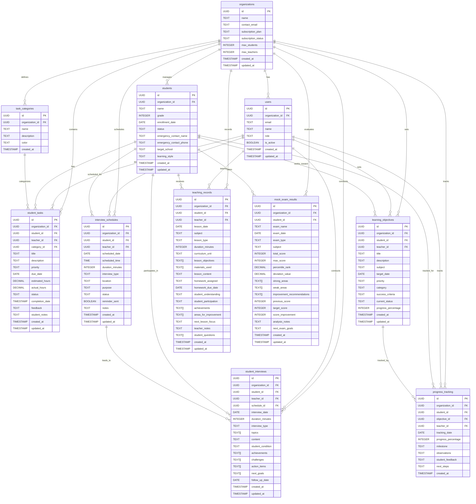

# Edore学習管理システム - ER図

## データベース構造図

## テーブル別詳細説明

### 1. 基本テーブル（認証・組織系）

#### `organizations` - 組織（塾）
- **目的**: 各塾の基本情報と契約プランを管理
- **特徴**: 
  - プライバシー重視（代表連絡先のみ）
  - プラン別の利用上限設定
  - 組織間の完全なデータ分離

#### `users` - ユーザー（講師・管理者）
- **目的**: 講師・管理者の認証と権限管理
- **特徴**:
  - 最小限の個人情報
  - 役割ベースのアクセス制御
  - アクティブ状態の管理

#### `students` - 生徒
- **目的**: 生徒の基本情報（プライバシー重視）
- **特徴**:
  - 緊急時連絡先のみ保持
  - 学習スタイルの記録
  - 進路目標の管理

### 2. タスク管理系

#### `task_categories` - タスクカテゴリ
- **目的**: タスクの分類と視覚的管理
- **特徴**:
  - 組織ごとのカスタマイズ
  - UI表示用の色設定
  - 宿題、復習、試験対策等の分類

#### `student_tasks` - 生徒タスク
- **目的**: 宿題・課題の詳細管理
- **特徴**:
  - 優先度と期限管理
  - 予想時間と実際時間の記録
  - 進捗状況の追跡
  - 講師フィードバック

### 3. スケジュール管理系

#### `interview_schedules` - 面談スケジュール
- **目的**: 面談予定の事前管理
- **特徴**:
  - 日時と場所の管理
  - 面談目的の明確化
  - リマインダー機能
  - 状態管理（予定/完了/キャンセル）

#### `student_interviews` - 面談記録
- **目的**: 面談の詳細記録
- **特徴**:
  - スケジュールとの連携
  - 構造化された記録方式
  - 達成事項と課題の明確化
  - フォローアップ予定

### 4. 学習目標・進捗管理系

#### `learning_objectives` - 学習目標
- **目的**: 明確な学習目標の設定
- **特徴**:
  - 達成基準の明確化
  - 進捗パーセンテージ
  - 科目・カテゴリ別の分類
  - 期限管理

#### `progress_tracking` - 進捗追跡
- **目的**: 学習目標の進捗を時系列で追跡
- **特徴**:
  - 定期的な進捗記録
  - マイルストーンの記録
  - 生徒・講師双方のフィードバック
  - 次のステップの明確化

### 5. 指導記録系

#### `teaching_records` - 指導履歴
- **目的**: 授業の詳細記録（改良版）
- **特徴**:
  - 授業の目標と成果の記録
  - 生徒の質問の保存
  - 次回授業の重点事項
  - 改善点の継続的な追跡

### 6. 評価系

#### `mock_exam_results` - 模試結果
- **目的**: 模試結果の詳細分析
- **特徴**:
  - 得意・苦手分野の分析
  - 前回との比較
  - 改善提案の記録
  - 次回試験の目標設定

## 特徴と改善点

### 🆕 新機能

1. **面談スケジュール管理**
   - 事前の面談予定管理
   - リマインダー機能
   - 面談記録との連携

2. **生徒タスク管理**
   - 宿題・課題の詳細管理
   - 期限と優先度の設定
   - 進捗状況の可視化

3. **学習目標・進捗管理**
   - 明確な目標設定
   - 定期的な進捗追跡
   - 達成度の可視化

### 🔒 プライバシー強化

1. **個人情報の最小化**
   - 不要な個人情報項目を削除
   - 緊急時連絡先のみ保持
   - 学習関連情報の重視

2. **データ保持期間の明確化**
   - 卒業・退塾時の自動削除
   - 匿名化された統計データの活用

### 📊 可視化改善

1. **サマリービューの追加**
   - `student_summary`: 生徒の学習状況一覧
   - `teacher_workload`: 講師の業務量把握

2. **ダッシュボード対応**
   - 重要指標の自動計算
   - 講師・生徒・管理者別の最適化

### ⚡ パフォーマンス最適化

1. **適切なインデックス設計**
   - 頻繁に検索される項目
   - 組織別のデータ分離
   - 日付範囲検索の最適化

2. **効率的なクエリ**
   - ビューによる複雑な集計の簡素化
   - 外部キー制約による整合性保証 